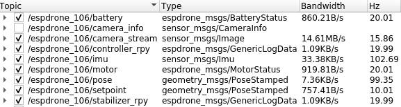

# espdrone-ros
This repository contains ROS packages for Espdrone interface.

This stack is the main dependency of the package [`espdrone-aruco-ros`](https://github.com/AndrianH18/espdrone-aruco-ros), a set of ROS packages for data processing and ArUco marker detection for localization purposes. Both this repository and `espdrone-aruco-ros` are specialized for the NTU EEE UAVIONICS DIP project.

It has been well tested on **Ubuntu 20.04 with ROS Noetic** as well as on [Espdrone Docker container](https://hub.docker.com/repository/docker/nelsenew/espdrone).
## Overview

ROS stack for Espdrone, with the following features:

* Support for [Espdrone](https://github.com/NelsenEW/espdrone-nh)
* Publishes on-board sensors in ROS standard message formats, and custom message formats.
* Supports ROS parameters to reconfigure espdrone parameters
* Enable console debugging from Espdrone.
* Support for using multiple Espdrone control under STA mode.
* Depends on the [espdrone-lib-python](https://github.com/NelsenEW/espdrone-lib-python)

## Setup
The package depends on [espdrone-lib-python](https://github.com/NelsenEW/espdrone-lib-python), make sure that it is installed on your system or on your Docker environment.

The steps here assume that you already have ROS and Catkin workspace setup or you are using a [Docker container](https://hub.docker.com/repository/docker/nelsenew/espdrone). If you have not done so, check out how to install ROS in the [official Wiki](http://wiki.ros.org/noetic/Installation/Ubuntu), then run these to create a Catkin workspace:
```bash
source /opt/ros/noetic/setup.bash
mkdir -p <path/to/catkin_ws>/src
cd <path/to/catkin_ws>
catkin build

# Automatically source setup.bash for convenience.
echo "source <path/to/catkin_ws>devel/setup.bash" >> ~/.bashrc
source ~/.bashrc
```
If you already have ROS and Catkin workspace setup, then you can clone the package into your catkin workspace:
```
git clone https://github.com/NelsenEW/espdrone_ros.git
```
Use `catkin build` on your workspace to compile:
```bash
cd <path/to/catkin_ws>
catkin build
```

## Usage

There are three packages included: espdrone_driver, espdrone_utils, espdrone_msgs.

### Espdrone_driver

This package contains the driver. In order to support multiple Espdrones simultaneously, there is espdrone_server (communicating with all Espdrones) and espdrone_add to dynamically add Espdrones.

#### espdrone_server.py
The server does not communicate to any Espdrone initially, hence, `espdrone_add` needs to be used. In addition, the server will automatically remove the drone when connection to the drone is lost.

The server can be run with the following command:

``` bash
roslaunch espdrone_driver espdrone_server.launch
```

#### espdrone_add.py
To add the drone into the server, we have to modify the launch file on `espdrone_add.launch` as it contains the [parameters](#parameters).
``` bash
roslaunch espdrone_driver espdrone_add.launch
```
### Espdrone_msgs
This package contains all the custom messages and services for additional features from the espdrone-lib-python. The package is mainly used in the `espdrone_driver` package.

### Espdrone_utils
This package contains a simple camera streamer and send waypoints scripts. The simple camera streamer does not require the use of `espdrone-lib-python`. The send waypoint script is used to provide list of waypoint for the drone to execute, which rely on custom services from the espdrone_msgs.

## ROS Features

### Parameters

The launch file, `espdrone_add.launch` supports the following arguments:
* `uri`: IP address of the espdrone, e.g. '192.168.43.42' 
* `tf_prefix`: tf prefix for the espdrone frame(s). This is also act as a **namespace** for the rostopic.
* `roll_trim`: Trim in degrees, e.g. negative if flie drifts to the left
* `pitch_trim`: Trim in degrees, e.g. negative if flie drifts forward
* `enable_logging`: Enable logging from the drone.
* `enable_parameters`: Get the parameters from the drone and put it on the parameter server.
* `use_ros_time`: Set the parameter to **False** to use the drone timestamp.
* `enable_logging_<feature>`: Enable the specific logging feature from the drone only if the `enable_logging` is set to **True**.
* `enable_pose_tf_publisher`: Enable the transform publisher for the drone's pose.
* `custom_log_file`: Path to the specific log file that contains the additional logging configuration.
* `camera_info_file`: Path to the camera info file that contains the camera intrinsic and extrinsic parameters.

### Subscribers
#### cmd_vel
This allows us to control the roll, pitch, yawrate, and thrust of the drone. The fields of data is as follow:
* linear.y: roll [e.g. -30 to 30 degrees]
* linear.x: pitch [e.g. -30 to 30 degrees]
* angular.z: yawrate [e.g. -200 to 200 degrees/s]
* linear.z: thrust [0 to 65535 (mapped to PWM output)]

#### cmd_full_state
This allows us to send full state control setpoint to the drone. The fields of data is as follow:
* pose.position: control the x, y, z coordinate in mm.
* twist.linear: control the x, y, z velocity in mm/s.
* acc: control the x, y, z acceleration in mm/s<sup>2</sup>.
* pose.orientation: Control the orientation of the drone in quaternion.
* twist.angular: control the rollrate, pitchrate, and yawrate of the drone in milliradians/s.


#### cmd_velocity_world
This allows us to control the velocity of the drone with respect to the world. The fields of data is as follow:
* vel : control the setpoint of the x, y, z velocity in m/s.
* yawrate: control the yaw rate in degrees/s.

#### cmd_hover
This allows us to control the velocity of the drone where the height is send as an absolute setpoint (intended to be the distance to the surface under the Espdrone).
* vx, vy: control the x and y velocity in m/s.
* yawrate: control the yaw rate in degrees/s.
* zDistance: control the absolute height from the surface to the drone.

#### cmd_stop
This allows us to stop the drone from going to the setpoint, and (potentially) falling.
#### cmd_position
This allows us to send position setpoint to the drone. The fields of data is as follow:
* x, y, z: control the absolute x, y, z coordinate setpoint position in m.
* yaw: control the absolute yaw angle in degree.

#### external_position
This allows us to send the position of the drone with respect to the world. The fields of data is as follow:
* point: provide the x, y, z position in m.

#### external_pose
This allows us to send the pose of the drone with respect to the world. It is similar to `external_position` with addition of the quaternion. The fields of data is as follow:
* pose.position: provide the x, y, z position in m.
* pose.orientation: provide the orientation of the drone in quaternion.
### Publishers



#### camera_stream
* sensor_msgs/Image
* contains the image readings from the camera
* update: 66.6 ms (15 fps).
* can be viewed in rviz and rqt_image_view.

#### camera_info
* sensor_msgs/CameraInfo
* contains the camera intrinsic and extrinsic values.
#### imu
* sensor_msgs/IMU
* contains the sensor readings of gyroscope and accelerometer
* The covariance matrices are set to unknown
* orientation is not set (this could be done by the magnetometer readings in the future.)
* update: 10ms
* can be viewed in rviz

#### battery
* espdrone_msgs/BatteryStatus
* Contains the voltage readings from the drone
* update: 50 ms
#### motor
* espdrone_msgs/MotorStatus
* contains 16 bits (0 to 65535) PWM value for all 4 motors.
* update: 50 ms

#### zranger
* espdrone_msgs/TofMeasurement
* contains the measurement obtain from the zranger in mm.
* update: 50 ms

#### pose
* geometry_msgs/PoseStamped
* contains the x, y, z position of the drone in meter and the orientation in quaternion as well as the timestamp.
* update: 10 ms

#### setpoint
* geometry_msgs/PoseStamped
* contains the x, y, z position of the setpoint of the drone in meter, the orientation setpoint in quaternion as well as timestamp.
* update: 100 ms

#### <custom_log>
* espdrone_msgs/GenericLogData
* contains the custom data logged in float32 array.
* update: customizable


### Services

#### update_params
The service is used to update the drone parameter by reading the ROS parameter server. The request require the following arguments:
* param: contains a list of string of a parameter in full name. The parameter full name format is `<group>/<name>`, e.g. `pid_attitude/yaw_ki`.

*Note: you should update the ROS parameter server before calling the service.*

#### set_group_mask
Not used as UDP multicast is disabled.

#### takeoff
Send the takeoff command to the drone with the following request arguments:
* height: takeoff height.
* duration: the amount of time taken to get to the specific height.
* groupMask: not used, set to 0.

#### land
Send the land command to the drone with the following request arguments:
* height: landing height.
* duration: the amount of time taken to get to the specific height.
* groupMask: not used, set to 0.

#### stop
Send the stop command to the drone with the following request arguments:
* groupMask: not used, set to 0

#### go_to
Send the go_to command to the drone with the following request arguments:
* goal: send the target x, y, z coordinate in m.
* yaw: send the target yaw in degrees.
* duration: the amount of time taken to get to the desired setpoint.
* relative: use relative setpoint positioning system if set to true. If it is set to false, the setpoint is with respect to the absolute coordinate system.
* groupMask: not used, set to 0

#### motor_set
Send the specific PWM value from 0 to 65535 to control all of the motors with the following request arguments:
* m1, m2, m3, m4: The target PWM value of each individual motor.
* enable: Set the enable to True to run the motors with the given PWM.

#### upload_trajectory
*Not yet implemented in the ESPDrone firmware*

#### start_trajectory
*Not yet implemented in the ESPDrone firmware*

#### task_dump
Get all the tasks that is running on the drone's CPU and their usage.
#### emergency
Set this to true to send emergency and set this to false to reset emergency.

#### is_flying
Get the flying status of the drone. The response with attribute success is set to **True** if the drone is flying.
#### is_emergency
Get the emergency status of the drone. The response with attribute success is set to **True** if the drone is in emergency state.